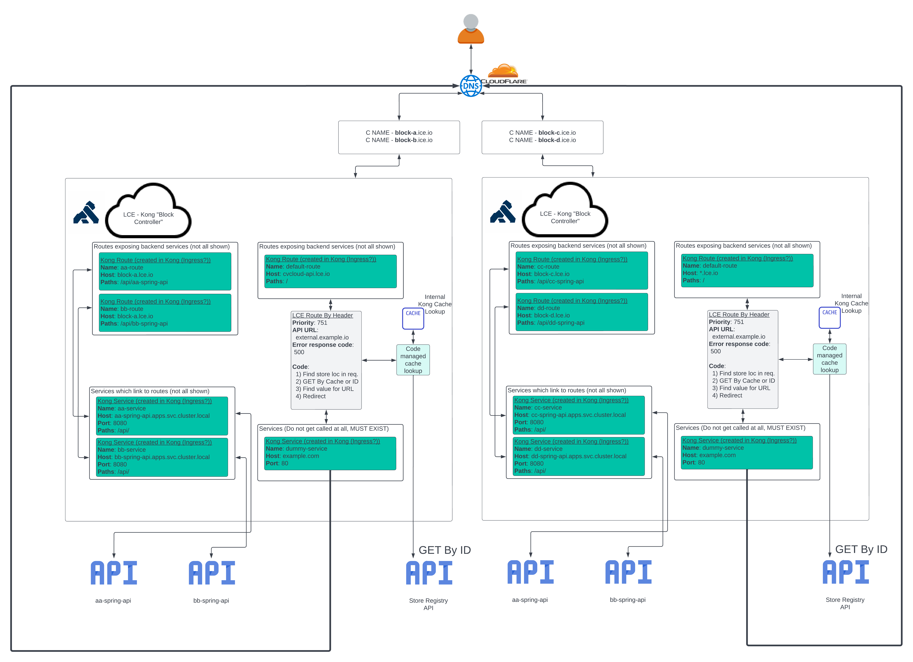

LCE Route By Header
====================
* Experimental code in `develop` branch
* Prerequisites: Lua knowledge / experience
* Kong version: 3.0.0



This custom route by header plugin is used to build a custom service for the next network hop. The next network hop is obtained from a `GET By ID` to a registry API service. The URL is a configurable location inside the JSON response form the API registry service, can be set with `path_to_url` which is explained in more detail below. The URL should be in the format `<scheme>://<host>` (ex. `https://example.com`).

A new feature in this plugin is its ability to use a `GET All` endpoint for obtaining an array of registry block objects in the registry api. To take advantage of this feature you MUST have the `Environment Configuration` variable applied and configured correctly. This feature is known as "pre-cache" and is ran by default on initial Kong worker startup using the [init_worker](https://docs.konghq.com/gateway/2.8.x/plugin-development/custom-logic/) phase AND can be populated by using the special Admin API endpoint explained in `Rebuilding All Internal Cache` below.

Environment Configuration
=================================
| ENV | Example | Description |
|---|---|---|
| KONG_UNTRUSTED_LUA_SANDBOX_ENVIRONMENT | LCE_REGISTRY_URL=https://mockbin.org/bin,<br />LCE_PATH_TO_ID=`$.id`,<br />LCE_PATH_TO_URL=`$.url`,<br />LCE_CACHE_TTL=259200,<br />LCE_DEBUG=1 | This is a CSV of K=V pairs.<br />* LCE_REGISTRY_URL is the GET All endpoint<br />* LCE_PATH_TO_ID is a jsonpath to the locationId/locationNumber in the request<br />* LCE_PATH_TO_URL is jsonpath to the string containing the next jump<br />* LCE_CACHE_TTL is in seconds how long to keep the k/v in memory<br />* LCE_DEBUG is an int 1=true 0=false |

Plugin Configuration
=================================
| Value | Required | Default | Description |
|---|---|---|---|
| cache_ttl | ✅ | 300 | How long in seconds to keep the store registry URL in memory |
| registry_api_url | ✅ |  | A URL to the registry API that returns upstream URLs |
| value_matching_pattern |  | %%s | A special character that can be replaced in the `registry_api_url` or `path_to_url`. The value in this field is interpreted as a [Lua pattern](https://www.lua.org/pil/20.2.html) this means sometimes the value needs to be escaped as in the default example  |
| key_names | ✅ |  | CSV of case insensitive strings that are matched to an HTTP request information in the order `headers -> query params -> body`. Body search only works if form-data or JSON |
| path_to_url | ✅ |  | A [jp](https://github.com/hy05190134/lua-jsonpath) value to a URL in the registry response that is used as the upstream |
| error_response_status_code | ✅ | 500 | The global response code used for all internal errors in the code |
| skip_large_bodies |  | false | An optional value that defines whether Kong should send large bodies that are buffered to disk. Note that enabling this option will have an impact on system memory depending on the number of requests simultaneously in flight at any given point in time and on the maximum size of each request. Also this option blocks all requests being handled by the nginx workers. That could be tens of thousands of other transactions that are not being processed. For small I/O operations, such a delay would generally not be problematic. In cases where the body size is in the order of MB, such a delay would cause notable interruptions in request processing. Given all of the potential downsides resulting from enabling this option, consider increasing the [client_body_buffer_size](https://docs.konghq.com/gateway/latest/reference/configuration/#nginx_http_client_body_buffer_size) value instead |
| debug |  | true | Creates logs in the proxy that explains processing flow using the INFO [log level](https://docs.konghq.com/gateway/latest/reference/configuration/#log_level) |

Plugin Config Example
=================================
```json
{
  "cache_ttl": 300,
  "registry_api_url": "https://mockbin.org/bin/%s",
  "value_matching_pattern": "%%s",
  "key_names": [
    "x-test",
    "x-mkbin",
    "x-custom-url"
  ],
  "path_to_url": "$.url",
  "error_response_status_code": 500,
  "skip_large_bodies": false,
  "debug": true
}
```

Rebuilding All Internal Cache
=================================
This plugin includes an additional Admin API endpoint for running the pre-cache function.
```
/precache (POST)
```

Managing Internal Cache
=================================
Kong provides 3 [Admin API endpoints](https://docs.konghq.com/gateway/latest/reference/clustering/#interacting-with-the-cache-via-the-admin-api) for interacting with the internal cache, below here are 2 of the more important ones: 

| Method | Path | Description |
|---|---|---|
| `GET` | `/cache/{cache_key}` | Where the cache key would be the value from the request we cached, the location id/location number |
| `DELETE` | `/cache` | Purge cache |

As an example here the [Kong Mockbin](https://mockbin.org/) website is used as the Registry API, the plugin configuration would be similar to the example above and would contain these values:
```json
{
  "registry_api_url": "https://mockbin.org/bin/%s",
  "value_matching_pattern": "%%s",
  "key_names": [
    "x-test"
  ],
  "path_to_url": "$.privateUrl"
}
```

If an incoming request looked like this:
```
POST /api/v1/examples HTTP/1.1
Host: example.com
Content-Type: application/json
x-test: fc4a1903-dd32-4543-a0ed-9d1c2d3c6aad

{"data": "eyJtZXNzYWdlIjogInRoaXMgaXMgZXhhbXBsZSBkYXRhIn0K"}
```

The cache key in this example is `fc4a1903-dd32-4543-a0ed-9d1c2d3c6aad`. A lookup URL to the Registry is created like `https://mockbin.org/bin/fc4a1903-dd32-4543-a0ed-9d1c2d3c6aad` and the response is:
```json
{
  "id": "jsddfq1234asdf2z",
  "createdDateTime": "2022-08-08T18:22:55.27889847",
  "uploadedBy": "Aaron Renner <admin@aar.dev>",
  "locationNumber": "1234",
  "blockId": "AA",
  "confluentId": "1",
  "publicUrl": "https://proxy.lce.com/v1/anything",
  "privateUrl": "https://10.0.24.13",
  "mongoDBClusterMapping": {
    "storeSpecific": "AppSettings_MongoConnectionString_StoreData_1",
    "nonStoreSpecific": "AppSettings_MongoConnectionString_NonStoreData_1"
  }
}
```

The resulting cache would be a Key/Value pair of
```
fc4a1903-dd32-4543-a0ed-9d1c2d3c6aad=https://10.0.24.13
```

Installation
=================================
Please review [plugin distribution](https://docs.konghq.com/gateway/latest/plugin-development/distribution/)

### Compile Custom Kong Gateway
```bash
docker build . -t '<image-name>:<version>`
```

Testing
=================================
This template was designed to work with the
[`kong-pongo`](https://github.com/Kong/kong-pongo) and
[`kong-vagrant`](https://github.com/Kong/kong-vagrant) development environments.

To test please install one framework above and run `pongo run` in the default repo

Example resources
=================================
* For a complete walkthrough of Kong plugin creation check [this blog post on the Kong website](https://konghq.com/blog/custom-lua-plugin-kong-gateway).
* For Kong PDK resources see [Kong docs](https://docs.konghq.com/gateway/latest/pdk/)